# UD7 – DML y Control de Transacciones (TCL)

---

## Paso 1: Espejo de Datos

```sql
CREATE TABLE productos_u4 AS SELECT * FROM OE.PRODUCT_INFORMATION;
CREATE TABLE inventario_u4 AS SELECT * FROM OE.INVENTORIES;
```

---

## Paso 2: Bloque de Inserción (INSERT)

**1. Simple: Inserta un producto con ID 7000, nombre 'Cable HDMI 2.1' y precio 25.**
```sql
INSERT INTO productos_u4 (product_id, product_name, list_price)
VALUES (7000, 'Cable HDMI 2.1', 25);
```
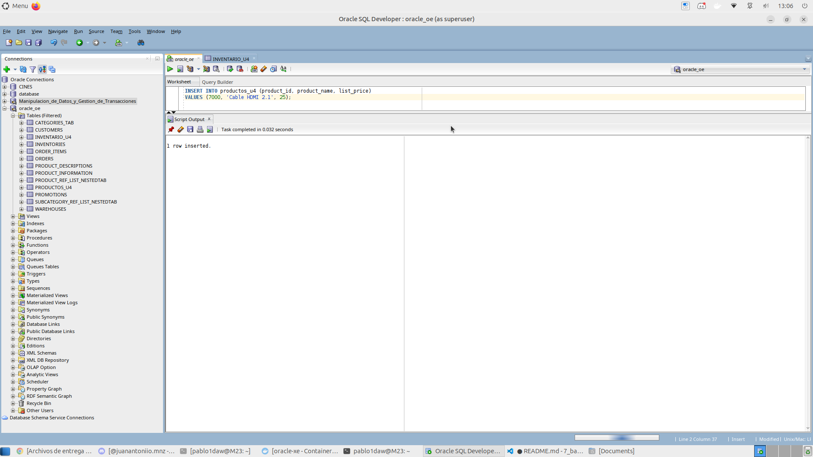
**2. Columnas específicas: Inserta el producto 7001 llamado 'Hub USB-C' solo con el ID, nombre y category_id = 10.**
```sql
INSERT INTO productos_u4 (product_id, product_name, category_id)
VALUES (7001, 'Hub USB-C', 10);
```
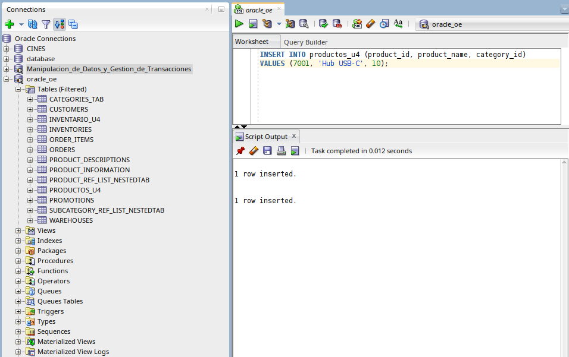
**3. Uso de Nulos: Inserta el producto 7002 con todos los campos pero deja warranty_period como NULL.**
```sql
INSERT INTO productos_u4 (product_id, product_name, product_description,
                           category_id, weight_class, warranty_period,
                           supplier_id, product_status, list_price,
                           min_price, catalog_url)
VALUES (7002, 'Producto Nulo Test', NULL,
        10, 1, NULL,
        NULL, 'available', 99,
        50, NULL);
```
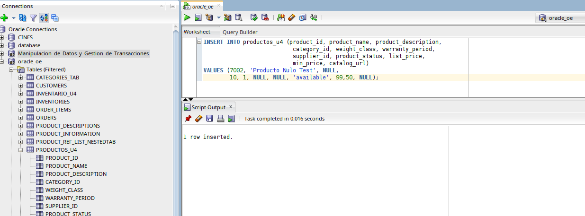
**4. Sintaxis de Fecha: Inserta un pedido en una tabla de log (puedes crearla) usando SYSDATE.**
```sql
CREATE TABLE log_inserciones (
    log_id    NUMBER GENERATED ALWAYS AS IDENTITY PRIMARY KEY,
    mensaje   VARCHAR2(200),
    fecha_log DATE DEFAULT SYSDATE
);

INSERT INTO log_inserciones (mensaje)
VALUES ('Inserción de prueba con SYSDATE');
```
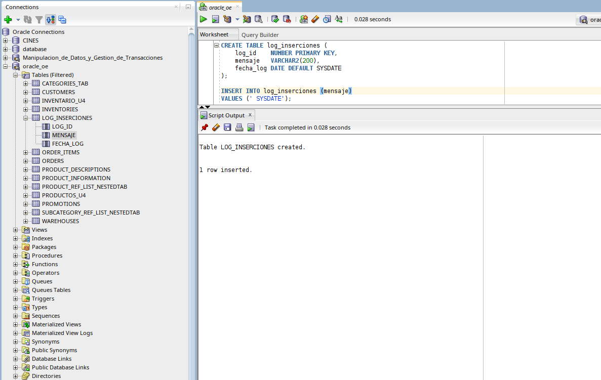
**5. Copia de fila: Inserta un nuevo producto cuyos datos sean idénticos al producto 1797 pero con ID 7003.**
```sql
INSERT INTO productos_u4
SELECT 7003, product_name, product_description,
       category_id, weight_class, warranty_period,
       supplier_id, product_status, list_price,
       min_price, catalog_url
FROM productos_u4
WHERE product_id = 1797;
```
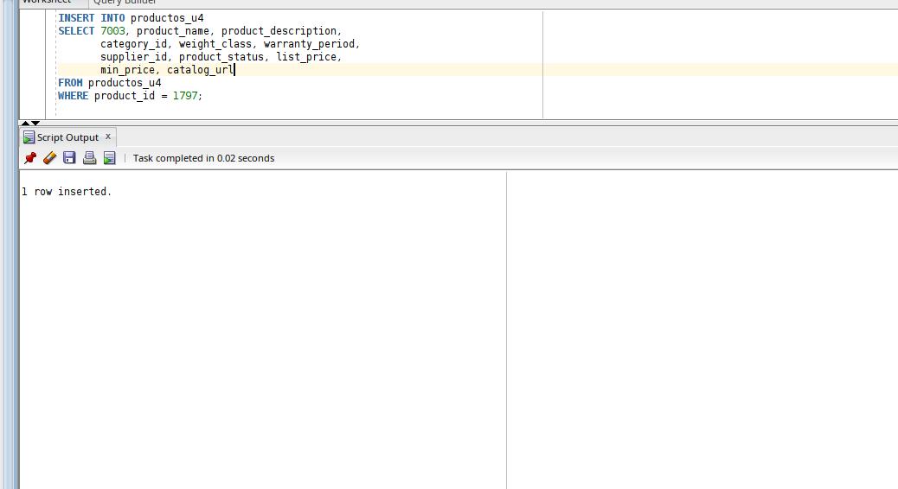
**6. Inserción Masiva: Inserta en productos_u4 todos los productos de la tabla original que tengan list_price > 5000.**
```sql
INSERT INTO productos_u4
SELECT * FROM OE.PRODUCT_INFORMATION
WHERE list_price > 5000;
```
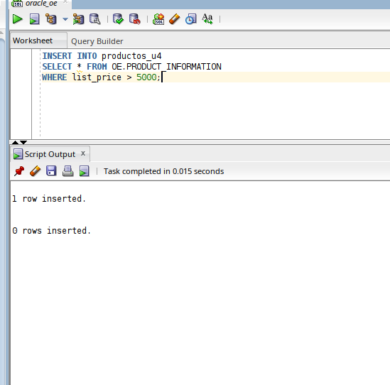
**7. Subconsulta con Filtro: Inserta productos de la categoría 11 que no existan actualmente en tu tabla productos_u4.**
```sql
INSERT INTO productos_u4
SELECT * FROM OE.PRODUCT_INFORMATION pi
WHERE pi.category_id = 11
  AND pi.product_id NOT IN (SELECT product_id FROM productos_u4);
```
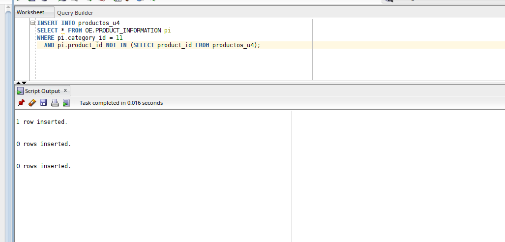
**8. Carga Parcial: Inserta solo el product_id y product_name de los productos que tienen stock en el almacén 1.**
```sql
INSERT INTO productos_u4 (product_id, product_name)
SELECT DISTINCT pi.product_id, pi.product_name
FROM OE.PRODUCT_INFORMATION pi
JOIN OE.INVENTORIES inv ON pi.product_id = inv.product_id
WHERE inv.warehouse_id = 1
  AND pi.product_id NOT IN (SELECT product_id FROM productos_u4);
```
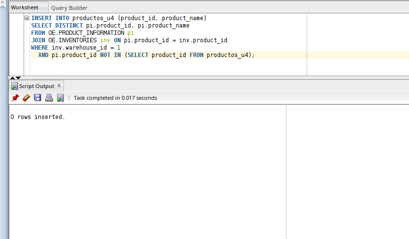
**9. Cálculo en Inserción: Inserta el producto 7005 con un list_price que sea el doble del precio medio de la categoría 10.**
```sql
INSERT INTO productos_u4 (product_id, product_name, category_id, list_price)
VALUES (
    7005,
    'Producto Precio Calculado',
    10,
    (SELECT AVG(list_price) * 2 FROM productos_u4 WHERE category_id = 10)
);
```
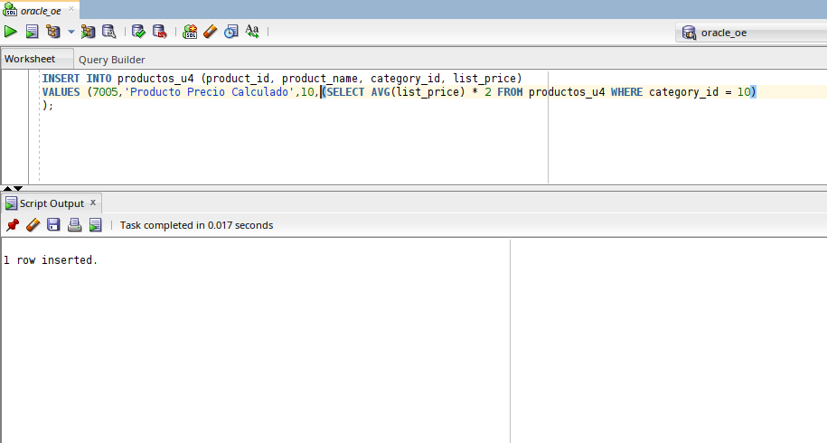
**10. Multitabla: Inserta en una tabla precios_altos todos los productos cuyo precio sea > 1000 usando un SELECT.**
```sql
CREATE TABLE precios_altos AS SELECT * FROM productos_u4 WHERE 1=0;

INSERT INTO precios_altos
SELECT * FROM productos_u4
WHERE list_price > 1000;
```
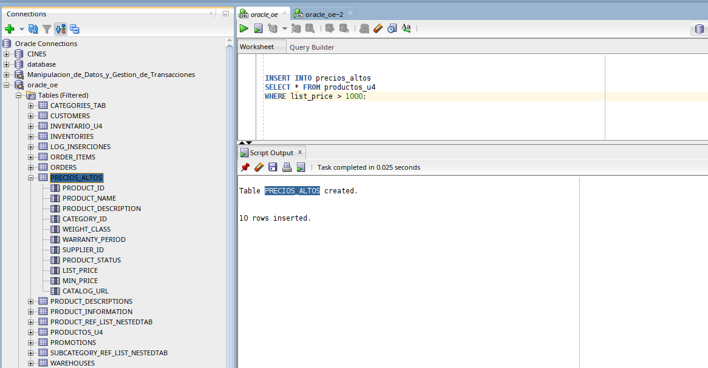


[paso2_insert.sql](paso2_insert.sql)

---

## Paso 3: Bloque de Modificación (UPDATE)

**1. Directo: Cambia el product_status a 'obsolete' para el producto 1797.**
```sql
UPDATE productos_u4 SET product_status = 'obsolete' WHERE product_id = 1797;
```
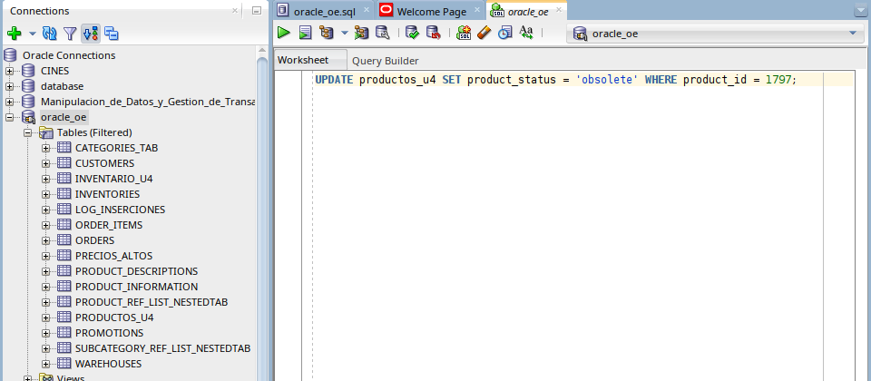
**2. Múltiple: Cambia el min_price a 50 y el list_price a 80 del producto 7000.**
```sql
UPDATE productos_u4 SET min_price = 50, list_price = 80 WHERE product_id = 7000;
```
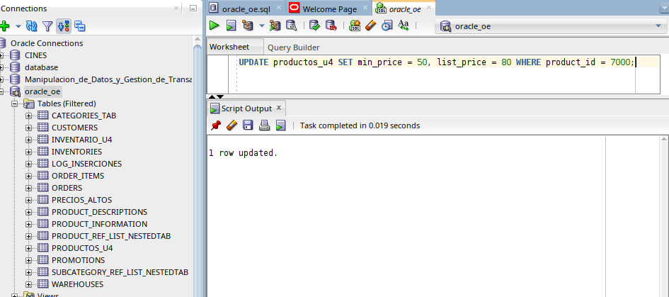
**3. Filtro Simple: Incrementa en 10 el precio de todos los productos de la categoría 12.**
```sql
UPDATE productos_u4 SET list_price = list_price + 10 WHERE category_id = 12;
```
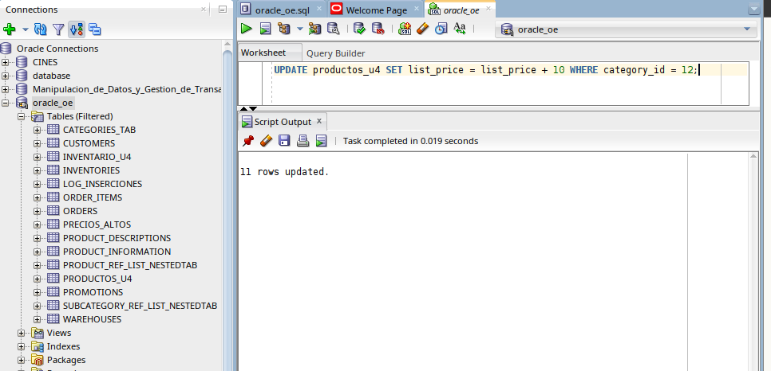
**4. Uso de LIKE: Pon en 'discontinued' todos los productos cuyo nombre empiece por 'Software%'.**
```sql
UPDATE productos_u4 SET product_status = 'discontinued'
WHERE product_name LIKE 'Software%';
```
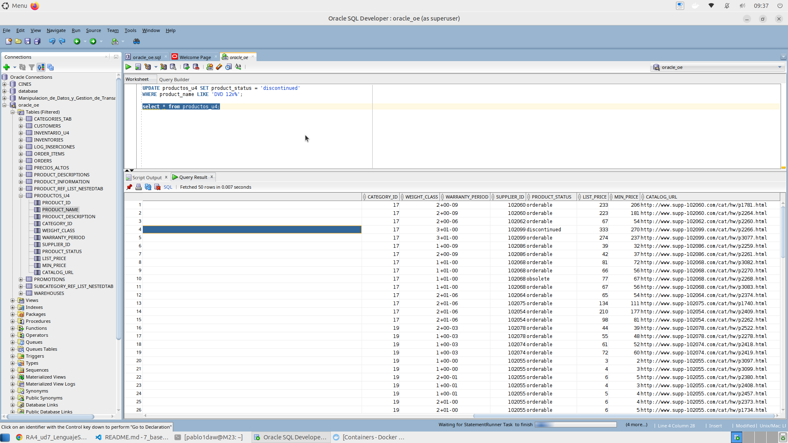
**5. Basado en NULL: Asigna un min_price de 5 a todos los productos que tengan ese campo como nulo.**
```sql
UPDATE productos_u4 SET min_price = 5 WHERE min_price IS NULL;
```
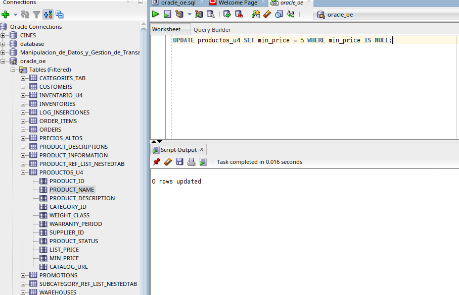
**6. Cálculo Porcentual: Rebaja un 20% el precio de los productos con weight_class = 5.**
```sql
UPDATE productos_u4 SET list_price = list_price * 0.80 WHERE weight_class = 5;
```
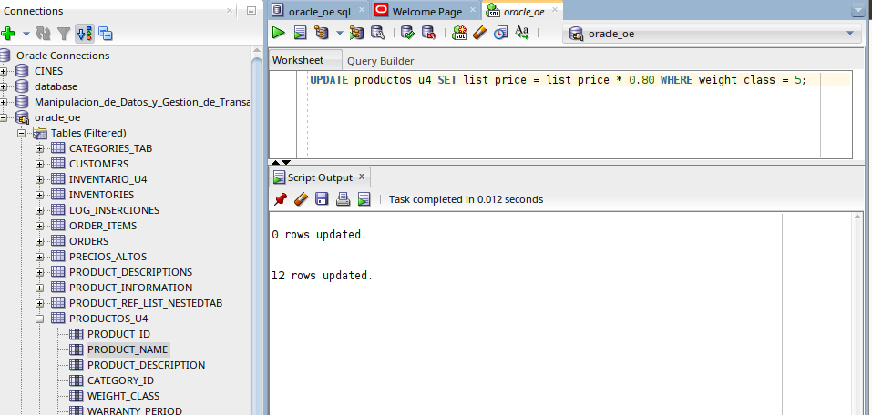
**7. Subconsulta Simple: Sube el precio 100€ a todos los productos que pertenezcan a la categoría llamada 'Software/Other' (buscando el ID en categories_tab).**
```sql
UPDATE productos_u4
SET list_price = list_price + 100
WHERE category_id = (
    SELECT category_id FROM OE.PRODUCT_CATEGORIES
    WHERE category_name = 'Software/Other'
);
```
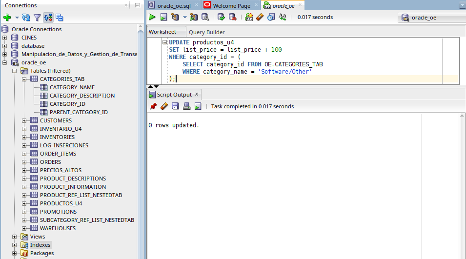
**8. Update Correlacionado: Actualiza el min_price de productos_u4 para que sea igual al precio más bajo registrado para ese producto en la tabla order_items.**
```sql
UPDATE productos_u4
SET min_price = (
    SELECT MIN(unit_price)
    FROM OE.ORDER_ITEMS
    WHERE product_id = productos_u4.product_id
);
```
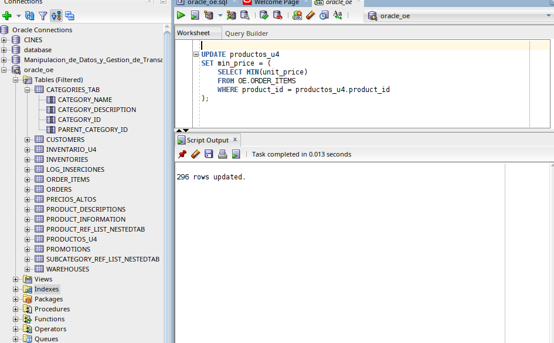
**9. Condición de Existencia: Cambia el estado a 'available' solo de aquellos productos que tengan al menos 1 unidad en el inventario_u4.**
```sql
UPDATE productos_u4
SET product_status = 'available'
WHERE product_id IN (
    SELECT product_id FROM inventario_u4
);
```
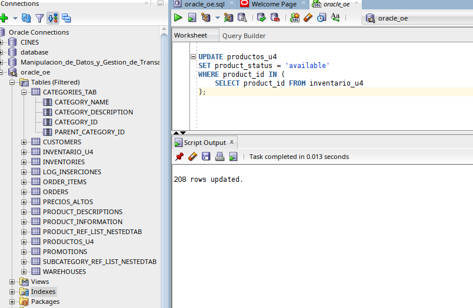
**10. Lógica Compleja: Si un producto tiene un list_price superior a la media global, redúcelo un 5%.**
```sql
UPDATE productos_u4
SET list_price = list_price * 0.95
WHERE list_price > (SELECT AVG(list_price) FROM productos_u4);
```
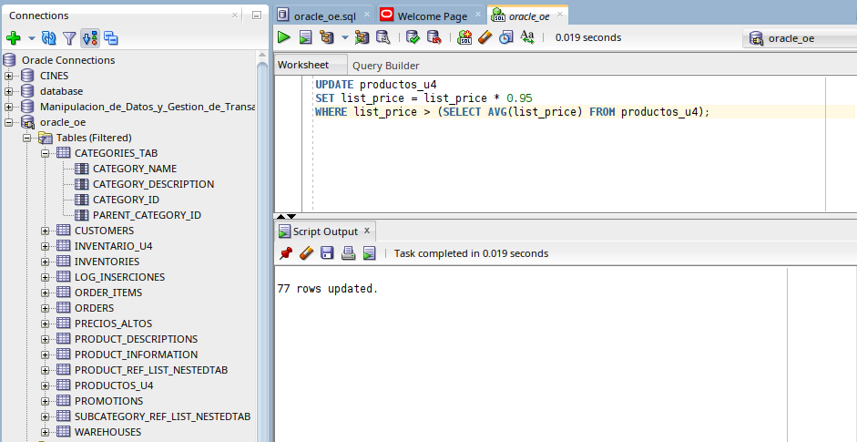

[paso3_update.sql](paso3_update.sql)

---

## Paso 4: Bloque de Borrado (DELETE)

**1. ID Específico: Borra el producto 7000.**
```sql
DELETE FROM productos_u4 WHERE product_id = 7000;
```
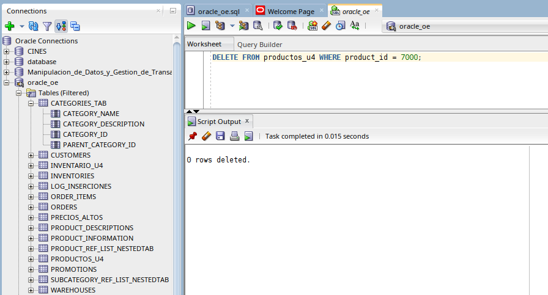
**2. Filtro de Texto: Borra todos los productos que contengan la palabra 'Test' en su descripción.**
```sql
DELETE FROM productos_u4 WHERE product_description LIKE '%Test%';
```
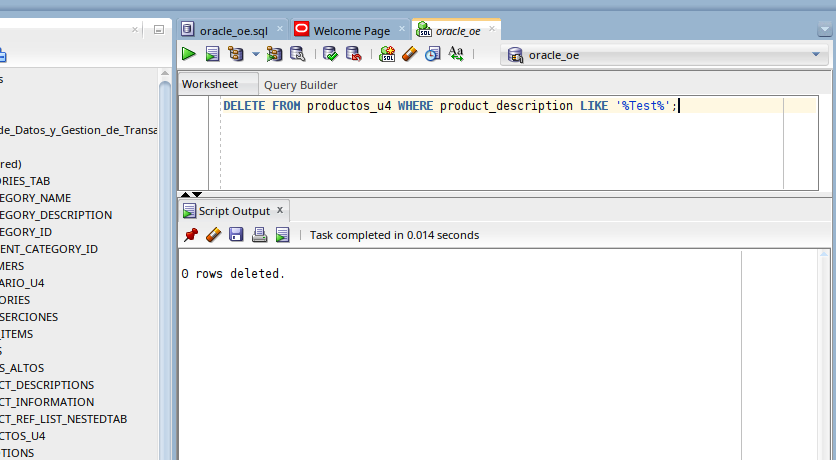
**3. Rango Numérico: Borra los productos con list_price entre 0 y 1.**
```sql
DELETE FROM productos_u4 WHERE list_price BETWEEN 0 AND 1;
```
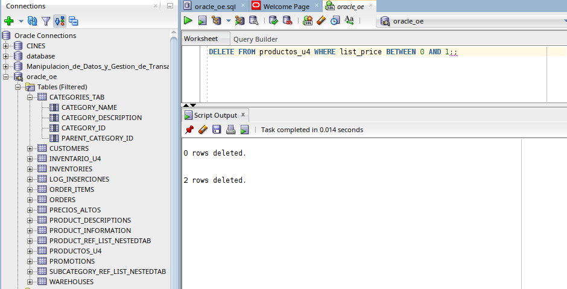
**4. Estado y Categoría: Borra productos de la categoría 10 que estén 'under development'.**
```sql
DELETE FROM productos_u4
WHERE category_id = 10 AND product_status = 'under development';
```

**5. Sin Inventario: Borra de productos_u4 aquellos que no tengan ninguna entrada en inventario_u4.**
```sql
DELETE FROM productos_u4 p
WHERE NOT EXISTS (
    SELECT 1 FROM inventario_u4 i WHERE i.product_id = p.product_id
);
```
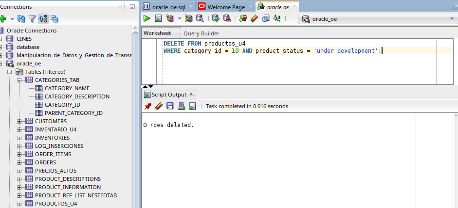
**6. Subconsulta de Agregación: Borra los productos cuyo min_price sea el más bajo de toda la tabla.**
```sql
DELETE FROM productos_u4
WHERE min_price = (SELECT MIN(min_price) FROM productos_u4);
```

**7. Relacional: Borra los productos que nunca hayan sido vendidos (que no aparezcan en order_items).**
```sql
DELETE FROM productos_u4 p
WHERE NOT EXISTS (
    SELECT 1 FROM OE.ORDER_ITEMS oi WHERE oi.product_id = p.product_id
);
```
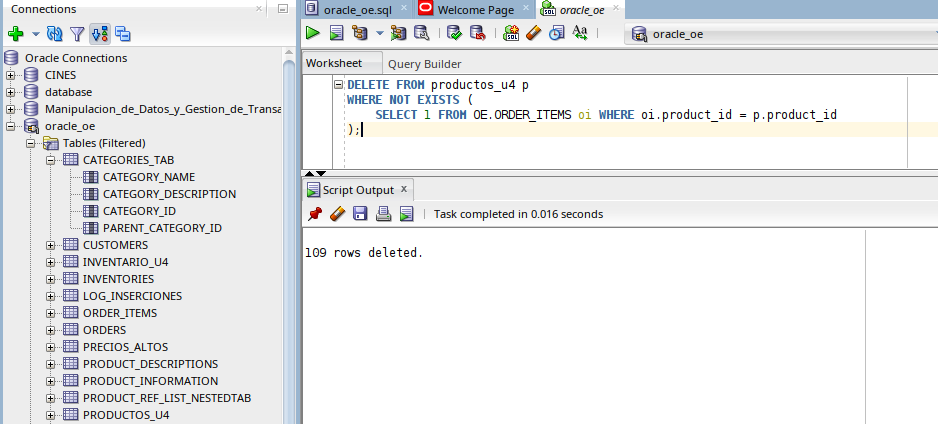
**8. Basado en Almacén: Borra del inventario todos los registros de productos que pertenezcan a almacenes situados en 'Japan' (requiere join con warehouses y locations).**
```sql
DELETE FROM inventario_u4
WHERE warehouse_id IN (
    SELECT w.warehouse_id
    FROM OE.WAREHOUSES w
    JOIN HR.LOCATIONS l ON w.location_id = l.location_id
    JOIN HR.COUNTRIES c ON l.country_id = c.country_id
    WHERE c.country_name = 'Japan'
);
```
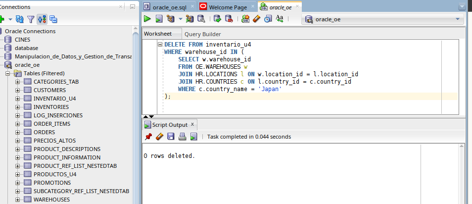
**9. Doble Condición Subquery: Borra productos cuya categoría tenga menos de 5 productos registrados.**
```sql
DELETE FROM productos_u4
WHERE category_id IN (
    SELECT category_id
    FROM productos_u4
    GROUP BY category_id
    HAVING COUNT(*) < 5
);
```
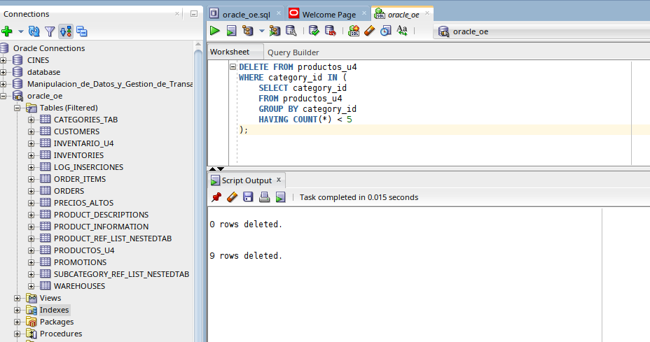
**10. Limpieza Total: Borra todos los registros de productos_u4 que insertaste en el paso 2 (IDs entre 7000 y 8000).**
```sql
DELETE FROM productos_u4 WHERE product_id BETWEEN 7000 AND 8000;
COMMIT;
```

[paso4_delete.sql](paso4_delete.sql)

---

## Paso 5: Transacciones y Concurrencia

```sql
CREATE TABLE cuenta_bancaria (
    id      NUMBER PRIMARY KEY,
    titular VARCHAR2(50),
    saldo   NUMBER(10,2)
);
INSERT INTO cuenta_bancaria VALUES (1, 'Usuario A', 1000);
INSERT INTO cuenta_bancaria VALUES (2, 'Usuario B', 2000);
COMMIT;
```
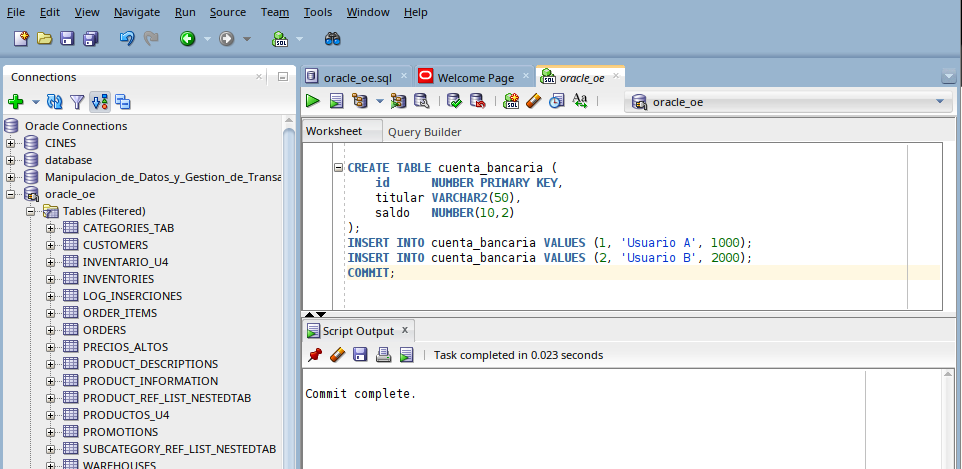
---

### Escenario 1: El Principio de Atomicidad (All-or-Nothing)

Simularemos una transferencia bancaria que falla a mitad de proceso.

1. Script que resta 500€ de la cuenta 1 e intenta sumar 500€ a una cuenta que no existe (ID 99):
```sql

UPDATE cuenta_bancaria SET saldo = saldo - 500 WHERE id = 1;


UPDATE cuenta_bancaria SET saldo = saldo + 500 WHERE id = 99;


SELECT * FROM cuenta_bancaria;


ROLLBACK;
```
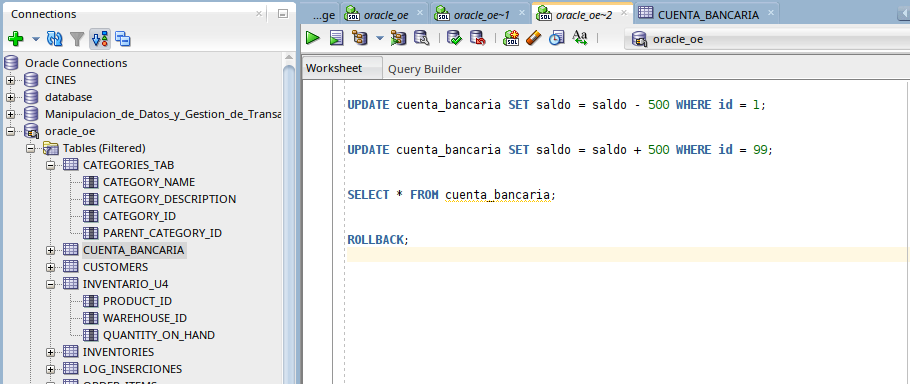
2. Verificación:
```sql
SELECT * FROM cuenta_bancaria;
```

3. Si la cuenta 1 tiene 500€, ejecutar ROLLBACK para restaurar la integridad:
```sql
ROLLBACK;
```

4. Es vital que estas dos operaciones vayan en un bloque con ROLLBACK porque una transferencia bancaria es una operación atómica: si el abono falla, el cargo también debe deshacerse. De lo contrario el dinero desaparece sin llegar a ningún destino, corrompiendo la integridad de los datos.

---

### Escenario 2: Puntos de Guardado y Deshacer Parcial

1. Subir el saldo un 10% y crear savepoint:
```sql
UPDATE cuenta_bancaria SET saldo = saldo * 1.10;
SAVEPOINT sp_subida;
```

2. Insertar nuevo titular y crear savepoint:
```sql
INSERT INTO cuenta_bancaria VALUES (3, 'Usuario C', 500);
SAVEPOINT sp_nuevo_usuario;
```

3. Borrar accidentalmente todos los usuarios:
```sql
DELETE FROM cuenta_bancaria;
```

4. Recuperación:
```sql
ROLLBACK TO SAVEPOINT sp_nuevo_usuario;
SELECT * FROM cuenta_bancaria;
```

---

### Escenario 3: Bloqueos y Tiempo de Espera

1. T1 — actualizar sin COMMIT:
```sql
UPDATE cuenta_bancaria SET saldo = 0 WHERE id = 1;
```

2. T2 — intentar el mismo UPDATE (queda bloqueada):
```sql
UPDATE cuenta_bancaria SET saldo = 5000 WHERE id = 1;
```

3. T1 — hacer COMMIT:
```sql
COMMIT;
```

T2 se desbloquea y aplica su UPDATE.

---

### Escenario 4: El "Commit Fantasma" (DDL)

1. Borrar al Usuario 2:
```sql
DELETE FROM cuenta_bancaria WHERE id = 2;
```

2. Sin hacer COMMIT, crear una tabla de log:
```sql
CREATE TABLE log_errores (msg VARCHAR2(100));
```

3. Intentar ROLLBACK:
```sql
ROLLBACK;
```

4. Verificación:
```sql
SELECT * FROM cuenta_bancaria;
```

5. El Usuario 2 **no vuelve**. En Oracle, cualquier sentencia DDL (`CREATE`, `ALTER`, `DROP`, `TRUNCATE`) emite un COMMIT implícito antes de ejecutarse. Esto confirma automáticamente cualquier transacción DML abierta, por lo que el ROLLBACK posterior ya no tiene ningún efecto sobre el DELETE.

 [paso5_transacciones.sql](paso5_transacciones.sql)